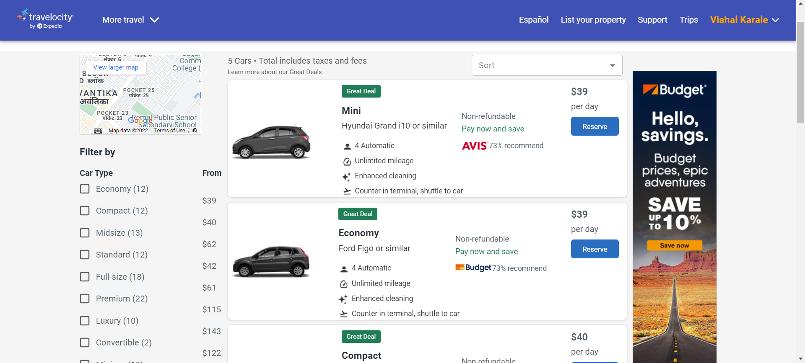
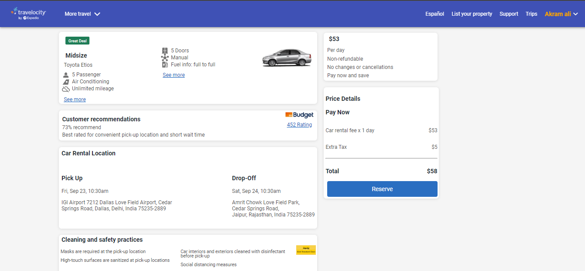
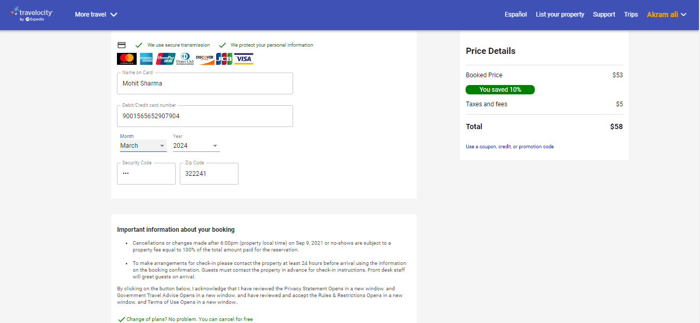

# Travelocity Clone

**This is the clone of the Travelocity website. Travelocity.com is a leading online travel Web site where travelers can make airline, hotel, and car rental reservations, book cruises and vacation packages, find information about destinations, and access a range of other travel-related services.**

**To see the Demo Video of Website click the below link.**

>Blog link : -

## Team Members
> ## Github :- •[Akram Ali](https://github.com/akram3598786)
>
> ## Github :- •[Mohit Sharma](https://github.com/mohitsharma9001)
>
> ## Github :-•[Vishal Karale](https://github.com/vishalvsk)

## Built with

<ul>
  <li>React js</li>
  <li>Redux</li>
  <li>HTML</li>
  <li>CSS</li>
  <li>JavaScript</li>
  <li>JSON Server</li>
  <li>Local Storage</li>
  <li>Google Auth</li>
  <li>Heroku</li>
  <li>Postman</li>
  <li>Netlify</li>
  
</ul>

## Used libraries

<ul>
  <li>Material-UI</li>
  <li>Styled-Components</li>
  <li>Redux</li>
  <li>React Js</li>
  <li>Redux</li>
  <li>React-router-dom</li>
  <li>React-Redux</li>
  <li>Material-Icons</li>
  <li>React Icons</li>
</ul>

## Features

<ul>
  <li>Signin/Signup</li>
  <li>Hotel search across world's cities</li>
  <li>Room booking in hotel</li>
  <li>Individual hotel details pages with differnt rooms</li>
  <li>Filter hotels list by their ratings, hotel name and budget range etc.</li>
  <li>Car searching by date, pickup and droping time</li>
  <li>Car Booking</li>
  <li>Payment gateway</li>
  <li>Responsive</li>
</ul>

## Some screenshots of the project :-

## Home Page

## Sign In page

## Hotel booking page

## Hotel detail page

## Car booking page

## Car detail page

## Payment page

### Thanks for Reading.
